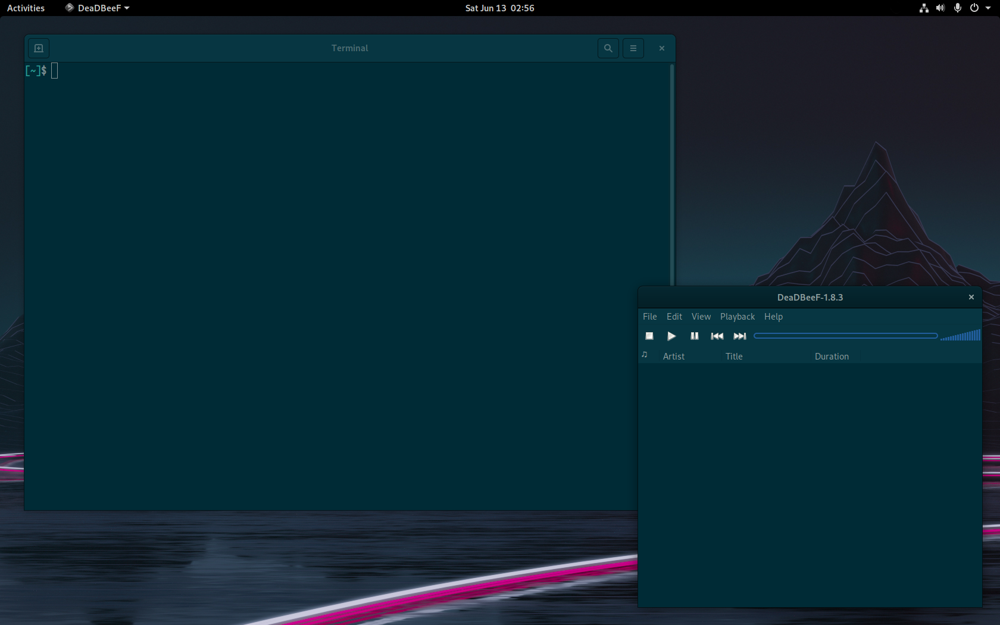

# Adwaita-Solarized

This is a modified version of Adwaita-dark, which uses the Solarized color
palette. As of now, only dark mode is supported.

## How to Build

The simplest way of building this package is to use the `generate` script
located in this repository. To be able to do so, the following dependencies
are required.

* csass
* inkscape
* optipng
* the original Adwaita theme that comes with GTK+3

After using the script, the theme can be located in the `package` directory,
which you can copy (or link) under your `~/.themes` folder under a new name.

## Licensing

The project is under the GPLv2 license, just like GTK+3 is, from which it was
derived from. See [the license file](LICENSE) for details.

## Screenshot

